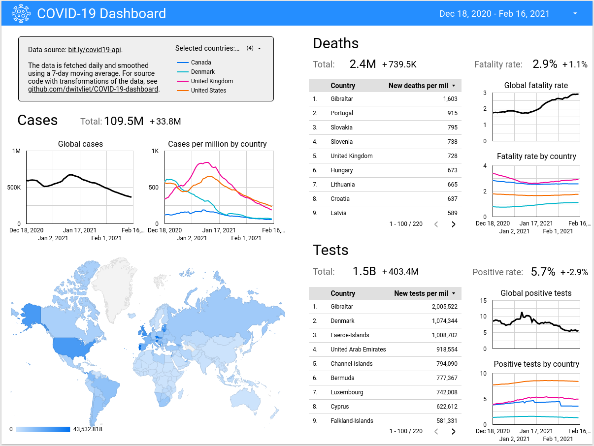

# Data Studio COVID-19 Dashboard

Code used to collect, clean, and upload COVID-19 data to GCP BigQuery for Data Studio to use as a data source. Can be deployed as a Docker image on GCP Cloud Run.

## Live dashboard

The dashboard is live on Google Data Studio: https://datastudio.google.com/reporting/8987e220-7ce6-4f84-8e99-6027a83105c3

## Screenshot

## Data sources

Confirmed COVID-19 cases, deaths, and tests performed were fetched from RapidAPI at https://rapidapi.com/api-sports/api/covid-193.
